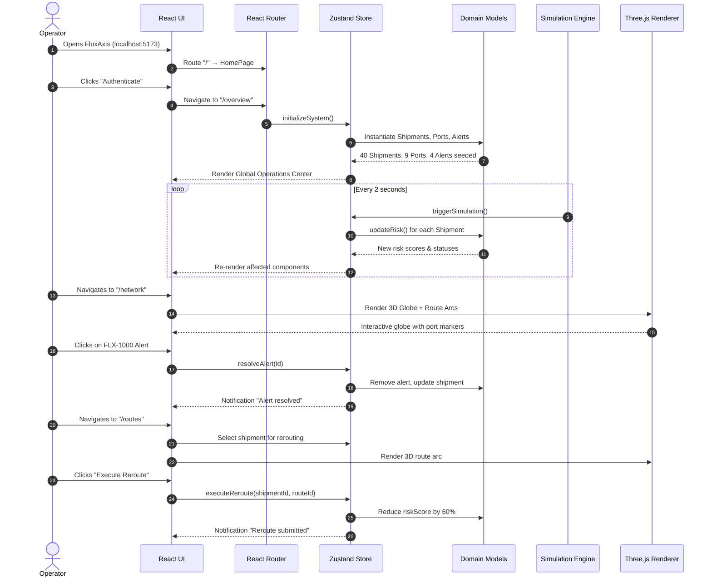
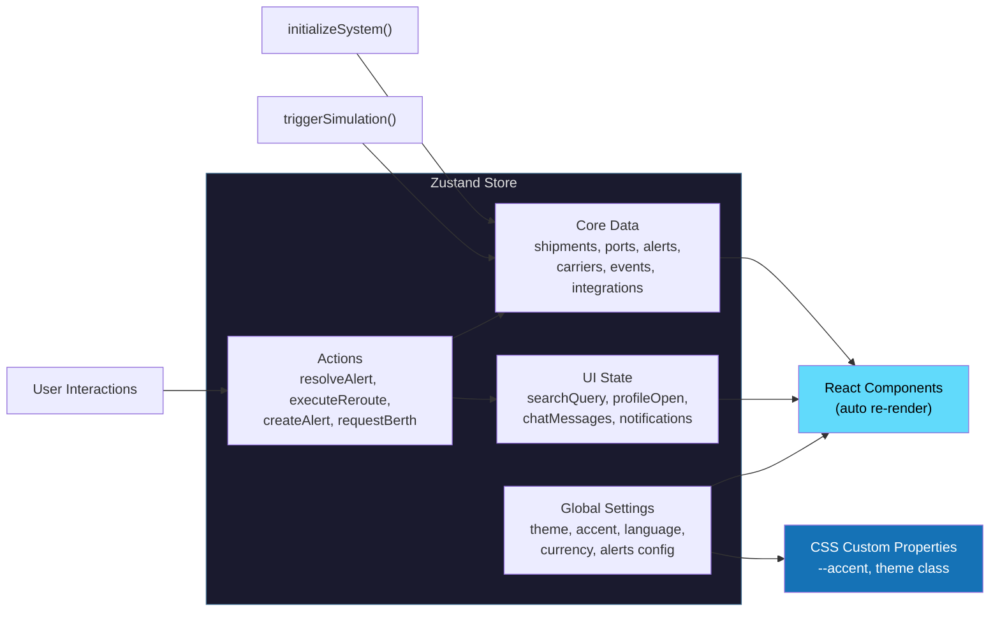
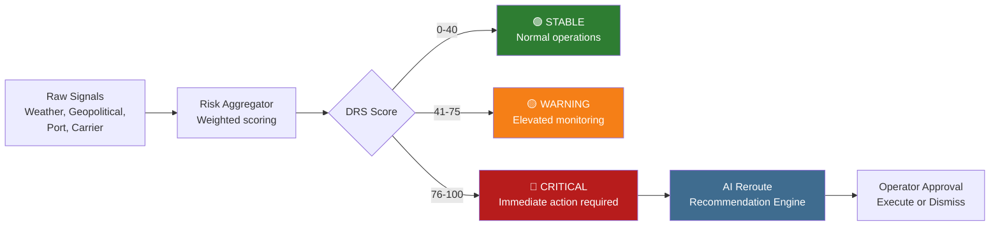
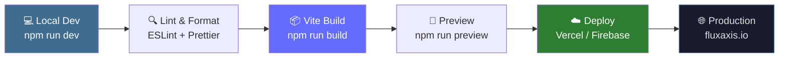

<p align="center">
  
</p>

<h1 align="center"> Supply Chain Intelligence Platform</h1>

<p align="center">
  <strong>Real-time global logistics monitoring, AI-driven risk assessment, and autonomous route optimization.</strong>
</p>

<p align="center">
  
  
  
  
  
  
  
  
  
  
  
  
  
  
</p>

<p align="center">
  <a href="#-features">Features</a> •
  <a href="#-screenshots">Screenshots</a> •
  <a href="#-getting-started">Quick Start</a> •
  <a href="#-project-structure">Structure</a> •
  <a href="#-contributing">Contributing</a>
</p>

---

## Overview

**FluxAxis** is an enterprise-grade supply chain intelligence platform designed to provide logistics operators with full situational awareness across global shipping networks. It combines real-time vessel tracking, AI-powered disruption risk scoring (DRS), predictive analytics, and autonomous rerouting into a single command center.

> Built for the **Google Solution Challenge 2026** — addressing UN SDG 9 (Industry, Innovation & Infrastructure) and SDG 12 (Responsible Consumption & Production).

### Problem Statement

Global supply chains face $4.4 trillion in annual disruptions from weather events, geopolitical instability, port congestion, and carrier failures. Traditional logistics tools offer fragmented visibility and reactive responses. FluxAxis transforms supply chain management from reactive firefighting to proactive intelligence.

---

## Features

| Category | Feature | Description |
|:---------|:--------|:------------|
| 🌐 **Operations** | Live Network Map | Interactive 3D globe with real-time vessel positions and route arcs |
| 📊 **Operations** | Global Operations Center | KPI dashboard with active shipments, SLA compliance, and risk metrics |
| 🚨 **Operations** | Alert Command | Severity-filtered signal dispatch with one-click resolution workflow |
| 🛤️ **Operations** | Route Intelligence | 3D route visualization with AI-recommended alternative routes |
| 🏗️ **Operations** | Port Intelligence | 3D terminal visualization with congestion, berth, and weather data |
| 🚢 **Operations** | Carrier Analytics | Fleet performance rankings with reliability and delay metrics |
| ⚡ **Operations** | Event Monitor | Live disruption event feed with affected shipment correlation |
| 🔮 **Intelligence** | Predictive Engine | Signal-based forecasting with confidence scoring and trend analysis |
| 📈 **Intelligence** | Analytics Hub | Throughput trends, delay analysis, and lane performance matrices |
| 🔄 **Intelligence** | Decision Loop | Operator feedback system for continuous model improvement |
| 🔌 **System** | Integrations | AIS tracker, NOAA weather, customs EDI, ERP, and AI model connectors |
| ⚙️ **System** | Settings | Theme customization, accent colors, notifications, and API management |

---

## Screenshots

### Landing — Operator Authentication
<p align="center">
  
</p>


---

## Data Flow — Sequence Diagram



---

## Application Flow — Flowchart


--- 

## Getting Started

### Prerequisites

- **Node.js** ≥ 18.0.0
- **npm** ≥ 9.0.0

### Installation

```bash
# Clone the repository
git clone https://github.com/your-username/fluxaxis-platform.git

# Navigate to project directory
cd fluxaxis-platform

# Install dependencies
npm install

# Start development server
npm run dev
```

The application will be available at **`http://localhost:5173`**

### Build for Production

```bash
# Create optimized production build
npm run build

# Preview production build locally
npm run preview
```

---

## 📁 Project Structure

```
fluxaxis-platform/
├── public/
│   ├── logo.png                    # App logo (transparent)
│   └── logo_pfp.png               # Logo profile picture
│
├── src/
│   ├── main.jsx                    # React entry point + BrowserRouter
│   ├── App.jsx                     # Root component + route definitions
│   │
│   ├── components/                 # Shared UI components
│   │   ├── Layout.jsx              # Dashboard shell (sidebar + topbar)
│   │   ├── Navbar.jsx              # Top navigation bar
│   │   ├── HeroSection.jsx         # Landing page hero with 3D background
│   │   ├── FeaturesSection.jsx     # Landing page feature cards
│   │   ├── MetricsSection.jsx      # Landing page live metrics
│   │   ├── DashboardSection.jsx    # Landing page dashboard preview
│   │   ├── Footer.jsx              # Landing page footer
│   │   ├── ShipmentMap.jsx         # Dotted world map with route lines
│   │   ├── AlertQueue.jsx          # Real-time alert feed component
│   │   ├── RoutePanel.jsx          # Route detail panel with 3D viz
│   │   └── ui/                     # Primitive UI components
│   │
│   ├── pages/                      # Route-level page components
│   │   ├── HomePage.jsx            # Authentication landing (/)
│   │   ├── LandingPage.jsx         # Global Operations Center (/overview)
│   │   ├── NetworkPage.jsx         # 3D Globe + Shipment list (/network)
│   │   ├── RiskPage.jsx            # Alert Command Center (/alerts)
│   │   ├── RoutesPage.jsx          # Route Intelligence (/routes)
│   │   ├── PortsPage.jsx           # Port Intelligence (/ports)
│   │   ├── CarriersPage.jsx        # Carrier Analytics (/carriers)
│   │   ├── EventsPage.jsx          # Event Monitor (/events)
│   │   ├── SignalsPage.jsx         # Predictive Engine (/predictive)
│   │   ├── AnalyticsPage.jsx       # Analytics Hub (/analytics)
│   │   ├── FeedbackPage.jsx        # Decision Loop (/feedback)
│   │   ├── IntegrationsPage.jsx    # System Integrations (/integrations)
│   │   └── SettingsPage.jsx        # User Settings (/settings)
│   │
│   ├── domain/                     # Object-Oriented Domain Models
│   │   └── models.js               # Shipment, Alert, Port, Integration
│   │
│   ├── store/                      # State Management
│   │   └── useAppStore.js          # Zustand store (300+ lines)
│   │
│   ├── data/                       # Static/Mock Data
│   │   └── mockData.js             # Seed data for development
│   │
│   └── styles/                     # Global Styles
│       └── globals.css             # CSS custom properties + themes
│
├── docs/
│   └── screenshots/                # App screenshots for documentation
│
├── index.html                      # HTML entry point
├── vite.config.js                  # Vite configuration
├── package.json                    # Dependencies & scripts
└── README.md                       # This file
```

---

## 🗺️ Route Map

| Route | Page | Description |
|:------|:-----|:------------|
| `/` | `HomePage` | Operator authentication with Google OAuth |
| `/overview` | `LandingPage` | Global Operations Center — KPI summary |
| `/network` | `NetworkPage` | 3D globe with live vessel positions |
| `/alerts` | `RiskPage` | Alert signal dispatch & triage |
| `/routes` | `RoutesPage` | Route visualization & AI rerouting |
| `/ports` | `PortsPage` | 3D terminal & congestion analytics |
| `/carriers` | `CarriersPage` | Carrier fleet performance rankings |
| `/events` | `EventsPage` | Live disruption event feed |
| `/predictive` | `SignalsPage` | Predictive signal engine |
| `/analytics` | `AnalyticsPage` | Throughput, delay & lane metrics |
| `/feedback` | `FeedbackPage` | Operator feedback loop |
| `/integrations` | `IntegrationsPage` | External system connectors |
| `/settings` | `SettingsPage` | Theme, profile & API management |

---

## 🔐 State Management Architecture



---

## 📊 Port Network Data

| Port | Code | Region | Congestion | Vessels | Berths | Throughput (TEU) |
|:-----|:----:|:------:|:----------:|:-------:|:------:|:----------------:|
| Shanghai | SHA | Asia Pacific | 42% 🟡 | 124 | 42 | 47,230 |
| Los Angeles | LAX | Americas | 82% 🔴 | 45 | 18 | 21,800 |
| Rotterdam | RTM | Europe | 25% 🟢 | 88 | 35 | 33,500 |
| Singapore | SIN | Asia Pacific | 15% 🟢 | 210 | 55 | 39,100 |
| Dubai | DXB | Middle East | 61% 🟡 | 62 | 22 | 18,900 |
| Tokyo | TYO | Asia Pacific | 33% 🟢 | 77 | 28 | 24,600 |
| New York | NYC | Americas | 44% 🟡 | 55 | 20 | 19,200 |
| Mumbai | MUM | South Asia | 55% 🟡 | 40 | 15 | 12,400 |
| Sydney | SYD | Oceania | 22% 🟢 | 30 | 12 | 8,700 |

---

## 🧮 Disruption Risk Score (DRS)

The **Disruption Risk Score** is FluxAxis's core risk metric, ranging from `0` (no risk) to `100` (maximum disruption).



| DRS Range | Status | Action | SLA Impact |
|:---------:|:------:|:-------|:-----------|
| 0 – 40 | 🟢 STABLE | Continue normal transit | None |
| 41 – 75 | 🟡 WARNING | Elevated monitoring, prepare alternatives | Potential +12h |
| 76 – 100 | 🔴 CRITICAL | Immediate reroute recommendation | SLA breach risk |

---

## 🔌 Integration Connectors

| Service | Type | Status | Latency | Records | Uptime |
|:--------|:----:|:------:|:-------:|:-------:|:------:|
| AIS Vessel Tracker | MARITIME | 🟢 Active | 42ms | 847K | 99.98% |
| NOAA Weather API | WEATHER | 🟢 Active | 88ms | 2.1M | 99.95% |
| Customs Broker EDI | CUSTOMS | 🟡 Degraded | 412ms | 340K | 97.22% |
| ERP SAP S/4 HANA | ERP | 🟢 Active | 64ms | 12.4M | 99.97% |
| Carrier EDI Network | CARRIER | 🟢 Active | 28ms | 5.8M | 99.99% |
| Port Community System | PORT | 🟢 Active | 110ms | 1.2M | 99.91% |
| GenAI Risk Model v3 | AI | 🟢 Active | 190ms | — | 99.85% |
| Stripe Payments | FINANCE | ⚪ Inactive | — | — | — |

---

## 🚀 Deployment Pipeline



---

## 🤝 Contributing

We welcome contributions! Please follow these steps:

1. **Fork** the repository
2. **Create** a feature branch (`git checkout -b feature/amazing-feature`)
3. **Commit** your changes (`git commit -m 'feat: add amazing feature'`)
4. **Push** to the branch (`git push origin feature/amazing-feature`)
5. **Open** a Pull Request

### Commit Convention

| Prefix | Purpose |
|:-------|:--------|
| `feat:` | New feature |
| `fix:` | Bug fix |
| `docs:` | Documentation only |
| `style:` | Formatting, no logic change |
| `refactor:` | Code restructuring |
| `perf:` | Performance improvement |
| `test:` | Adding tests |
| `chore:` | Build process or auxiliary |

---

## 📄 License

This project is licensed under the **MIT License** — see the [LICENSE](LICENSE) file for details.

---

<p align="center">
  
</p>

<p align="center">
  <strong>FluxAxis</strong> — Supply Chain Intelligence, Reimagined.
  <br />
  <sub>Built with ❤️ for the Google Solution Challenge 2026</sub>
</p>
